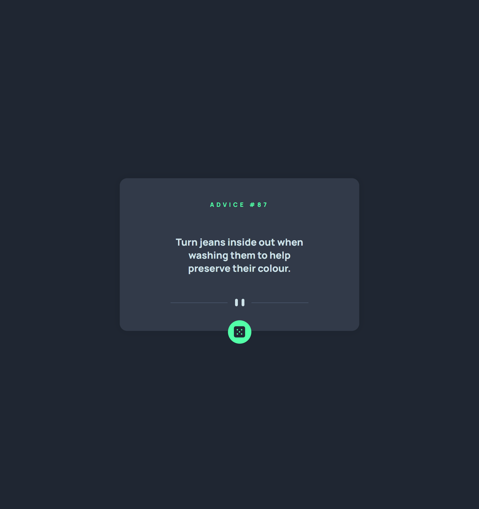

# Frontend Mentor - Advice generator app solution

This is a solution to the [Advice generator app challenge on Frontend Mentor](https://www.frontendmentor.io/challenges/advice-generator-app-QdUG-13db). Frontend Mentor challenges help you improve your coding skills by building realistic projects.

## Table of contents

- [Overview](#overview)
  - [The challenge](#the-challenge)
  - [Screenshot](#screenshot)
  - [Links](#links)
- [My process](#my-process)
  - [Built with](#built-with)
  - [What I learned](#what-i-learned)
  - [Continued development](#continued-development)
  - [Useful resources](#useful-resources)
- [Author](#author)

## Overview

This is a simple Advice Generator App built with React, Vite, and TypeScript. The app fetches random advice from an external API and displays it to the user. It also allows users to generate new advice at the click of a button. The goal of this project was to practice API integration, React hooks, and responsive layout techniques.

### The challenge

Users should be able to:

- View the optimal layout for the app depending on their device's screen size
- See hover states for all interactive elements on the page
- Generate a new piece of advice by clicking the dice icon

### Screenshot

### Links

- Solution URL: [solution URL here](https://www.frontendmentor.io/solutions/advice-generator-app-with-using-react-vite-ts-hYFGBnlA8I)
- Live Site URL: [live site URL here](https://minimalistic-advice-react-app.vercel.app/)

## My process

I started by setting up the project with Vite and configuring TypeScript. Then, I created a custom useFetch hook to handle API requests. After building the main layout and connecting the data, I focused on making the app responsive for different screen sizes. Finally, I added styling and polished the user experience.

### Built with

- Semantic HTML5 markup
- CSS custom properties
- Flexbox
- Mobile-first workflow
- JavaScript
- [React](https://reactjs.org/)
- TypeScript

### What I learned

During this project, I improved my skills in creating reusable React hooks and managing asynchronous operations. I learned how to handle API errors more effectively and how to design components that stay consistent across different devices. This project also reinforced my understanding of flexbox and responsive design techniques.

### Continued development

In the future, I would like to add animated transitions when advice is changed, improve accessibility by adding keyboard support, and optimize the application for even better performance. I am also considering adding tests for the custom hook to make the codebase more robust.

### Useful resources

- MDN Web Docs - Fetch API — Helpful for understanding how to work with fetch and handle errors properly.

- React documentation — Always an essential resource when building projects with React.

- Frontend Mentor Community — Great place for finding support and reading discussions about different approaches to challenges.

## Author

- GitHub - [click to move](https://github.com/PavAndrei)
- Frontend Mentor - [click to move](https://www.frontendmentor.io/profile/PavAndrei)
